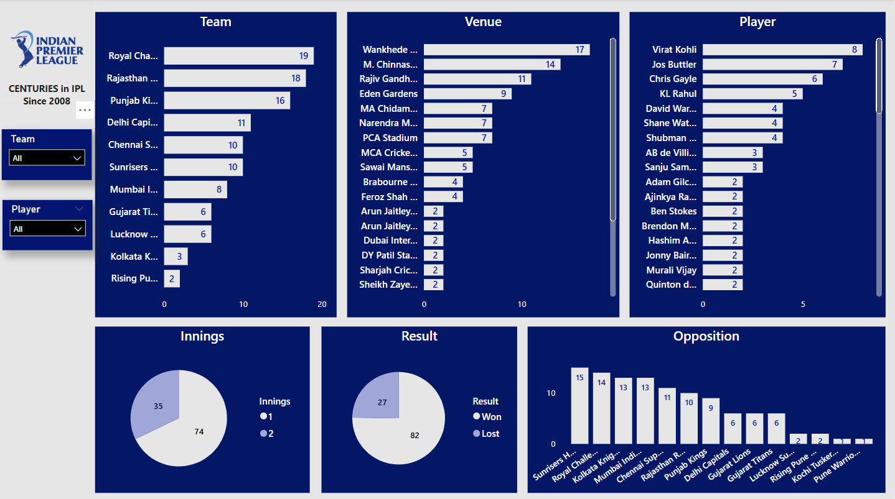

# 🏏 IPL 100s Dashboard

A Power BI dashboard that visualizes all centuries (100+ scores) in the Indian Premier League (IPL) — by team, player, opposition, and venue. This interactive dashboard helps cricket fans and analysts explore how hundreds are distributed across IPL history.

## 🔍 Project Overview

The IPL has seen some thrilling centuries over the years. This dashboard breaks down these century scores to answer questions like:

- Which players have the most hundreds?
- Which teams have conceded the most 100s?
- Which venues are most century-friendly?
- Impact of centuries in results.
- Which innings players scored more centuries?

## 📌 Key Features

- **Player-wise 100s**: View a ranked list of players with the most centuries.
- **Team-wise 100s**: Analyze the number of centuries scored by and against each IPL team.
- **Venue Analysis**: See which stadiums have seen the most IPL centuries.
- **Opposition Analysis**: Identify which teams have conceded the most centuries.
- - **Result analysis**: Identify the result impact while player score a century.

## 🧰 Tools Used

- **Power BI** for data modeling, DAX measures, and dashboard creation
- **Excel** for initial data cleaning and preparation
- **IPL datasets** (sourced from Kaggle)
- **SQL for data verification** for veryfing the results are 100% accurate

## 📸 Dashboard Preview

## 📁 How to Use

1. Open the `.pbix` file in Power BI Desktop.
2. Interact with filters to explore data by player, team, opposition, or venue.
3. Publish it to the Power BI Service to share with others.

## 📬 Contact

Created by **Muthu Sundar**  
📧 [mail: muthusundar48@gmail.com](mailto:muthusundar48@gmail.com)  
🔗 [GitHub: muthusundar48](https://github.com/muthusundar48)

---

